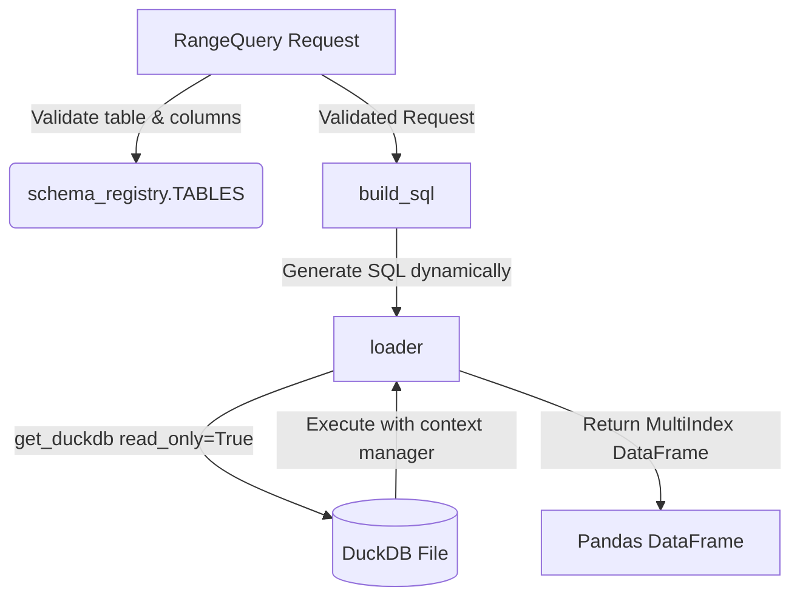

# Database Playground (Date-based Queries)

本项目模块 `quant_lab.data.loader` 设计了一套安全的、类型安全的数据查询机制，专用于从 DuckDB 中基于日期范围查询数据，并将结果转换为带有 MultiIndex 的 Pandas DataFrame。

## 核心设计理念

为了防止非法字段查询、硬编码 SQL 以及资源泄露，我们将数据关系定义拆分为三层：

1. **第一层：数据字典定义 (Table Schema)** —— 声明系统中有哪些表，每张表包含哪些字段以及其索引列是什么。
2. **第二层：请求对象约束 (Request Validation)** —— 使用 Pydantic 进行结构化检查与字段白名单验证。
3. **第三层：安全加载与资源释放 (Loader & SQL Builder)** —— 动态生成 SQL，确保以只读模式查询并安全释放 DuckDB 连接资源。

---

## 模块架构



### 1. 数据字典：`schema_registry.py`
[schema_registry.py](../src/quant_lab/data/schema_registry.py) 作为唯一的单一数据源，同时也是运行时的核心配置。

*   `TableSchema`：由 `dataclass(frozen=True)` 声明，定义了表名（`name`）、包含的字段（`columns`）以及索引列（`index`）。
*   `TABLES`：全局注册表。目前包含 `"prices"` 表，其列和索引分别引用 `OHLCV_COLUMNS` 和 `INDEX_COLUMNS`。

### 2. 请求约束与逻辑校验：`loader.py` 中的 `RangeQuery`
[loader.py](../src/quant_lab/data/loader.py) 声明了前端/调用端进入数据库之前的校验规则。

*   `TableName`：使用 `typing.Literal["prices"]` 来做静态编译期的类型检查和入口白名单约束。
*   `RangeQuery(BaseModel)`：Pydantic 模型，包含 `table`、`columns`、`start`（开始日期）和 `end`（结束日期）。
*   `@field_validator("columns")`：动态逻辑校验。它根据请求的 `table` 到运行时字典 `TABLES` 中查找对应 Schema，并检验传入的列是否全属于该表的合法列。若存在非法列，将抛出 `ValueError`；若 `table` 本身校验未通过，则优雅忽略以防崩溃。

### 3. 动态 SQL 与只读加载：`loader.py`
*   `build_sql(req)`：动态提取 TableSchema 中的索引位置（例如第一列作为日期过滤列，第二列作为标的代码列），拼接所需的 `select` 列并构建 SQL。这避免了将列名和表名完全硬编码在 SQL 中。
*   `loader(req)`：
    1.  通过 `get_duckdb(read_only=True)` 以只读模式连接 DuckDB，保护数据库免受非预期写入。
    2.  利用 Python 的 `with` 上下文管理器，确保查询完成后连接能被安全释放。
    3.  返回以表索引列（如 `date`, `ticker`）为 MultiIndex 的 DataFrame。

---

## 快速上手使用

```python
from quant_lab.data.loader import RangeQuery, loader

# 1. 构造一个合法的查询请求
query = RangeQuery(
    table="prices",
    columns=["open", "close"],
    start="2024-01-01",
    end="2024-01-05"
)

# 2. 通过 loader 加载数据
df = loader(query)
print(df.head())
```
